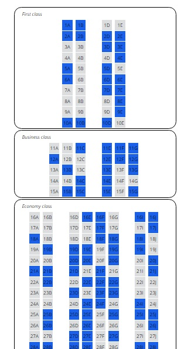
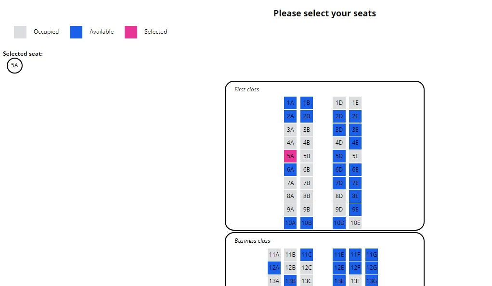

# Seats Assignment

This is an interactive web application to map the seats of a plane.

The seat map is dynamically generated by fetching the dummy data from [https://s3.amazonaws.com/frontend-candidate-homework.lola.co/seats.json](https://s3.amazonaws.com/frontend-candidate-homework.lola.co/seats.json).
(A copy is also included in the `/assets/data/` directory). 
- Seats have a cabin class (first, business, economy), a row (1, 2, etc.) and a letter assignment. 
- They can be occupied, available or selected.
- The aisle in a cabin class is determined by a missing letter in the seats (i.e. a, b, d, e - "c" is missing, so that's where the aisle is).
- Cabin classes should be programmatically generated to support any number of rows / columns.

Color legend:
- Gray: Unavailable seat
- Blue: Available seat
- Pink: Selected seat

  
 

## Instructions
In the project folder, run `npm install` to install the necessary modules. 
Then run `ng serve` for a dev server. Navigate to `http://localhost:4200/`.  
The app will automatically reload if you change any of the source files.

  
This project was generated with [Angular CLI](https://github.com/angular/angular-cli) version 7.3.5.
